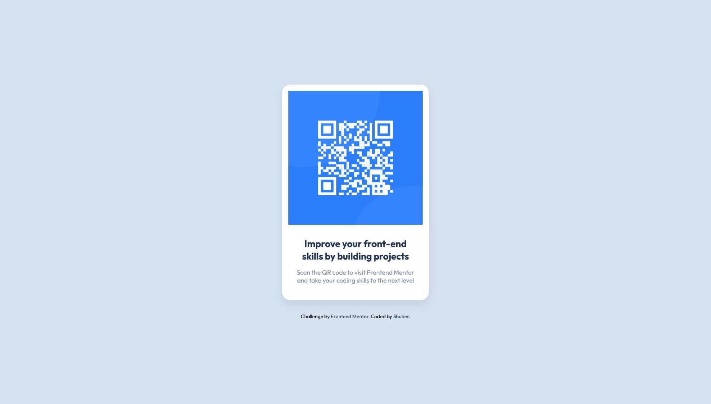

# Frontend Mentor - QR code component solution

This is a solution to the [QR code component challenge on Frontend Mentor](https://www.frontendmentor.io/challenges/qr-code-component-iux_sIO_H). Frontend Mentor challenges help you improve your coding skills by building realistic projects.

## Table of contents

- [Overview](#overview)
  - [Screenshot](#screenshot)
  - [Links](#links)
- [My process](#my-process)
  - [Built with](#built-with)
  - [What I learned](#what-i-learned)

## Overview

Hi! This is the first Frontend Mentor challenge I'm tackling after being stranded in 'tutorial hell' for several months.

For this QR code component, I used semantic HTML5 and CSS, with Flexbox for positioning elements. I initially thought of using SASS for writing up my styling, but I decided that I wanted to work on being able to write pure CSS as neatly as possible.

### Screenshot

Desktop

Mobile

### Links

- Solution URL: [Here!](https://github.com/sheronimo/frontendmentor-qrcode)
- Live Site URL: [Here!](https://sheronimo.github.io/frontendmentor-qrcode)

## My process

The first thing I did was look at the markup and tweak it by changing some of the tags to be more semantic, and adding class names. My personal styling methodology is a preference for classes as opposed to targeting tags or IDs.

For the styling, I started off declaring all my base styles before moving on to styling the elements, and then fixing spacing, positioning and sizing after.

### Built with

- Semantic HTML5 markup
- CSS variables
- Flexbox
- CSS Grid

### What I learned

How to center a "div". 😅

Centering small elements horizontally and vertically on a page are something I'm prone to overthinking about, as most of my previous practice has involved creating long webpages. I went with using Flexbox to achieve this. Big fan of Flexbox. 🌹

## Author

- Github - [sheronimo](https://github.com/sheronimo)
- Frontend Mentor - [@sheronimo](https://www.frontendmentor.io/profile/sheronimo)
